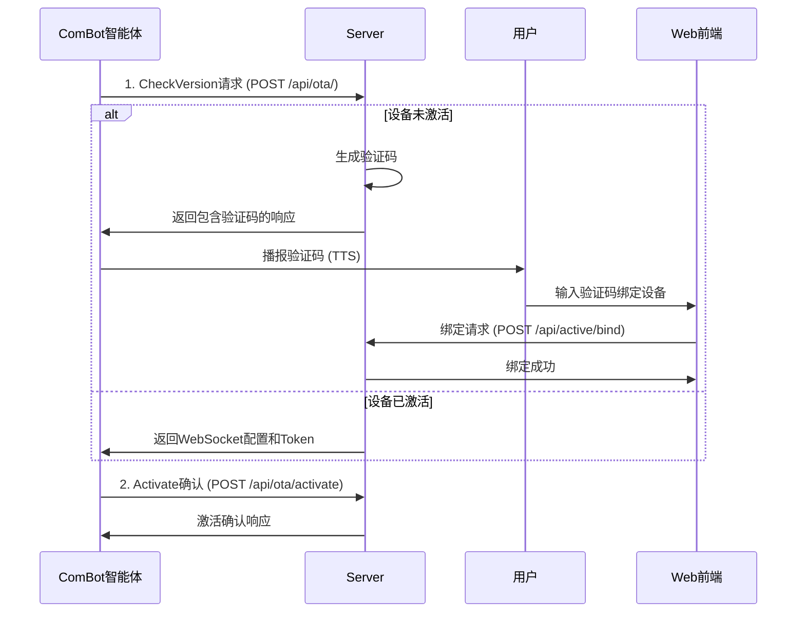

# ComBot与Server交互流程文档

## 概述

本文档详细说明了ComBot智能体与Server之间的交互流程，包括设备激活、验证码生成、用户绑定等功能。所有结论都基于对ComBot源代码的分析。

## 交互流程概览



## 详细交互分析

### 1. CheckVersion请求流程

#### 1.1 ComBot发起请求

**代码位置**: `combot/main/ota.cc:75-100`

```cpp
bool Ota::CheckVersion() {
    // ...
    std::string url = GetCheckVersionUrl();  // 获取OTA URL
    auto http = SetupHttp();                 // 设置HTTP请求
    std::string data = board.GetJson();      // 获取设备信息JSON
    std::string method = data.length() > 0 ? "POST" : "GET";
    http->SetContent(std::move(data));
  
    if (!http->Open(method, url)) {
        ESP_LOGE(TAG, "Failed to open HTTP connection");
        return false;
    }
    // ...
}
```

**请求详情**:

- **URL**: 来自 `GetCheckVersionUrl()` - `combot/main/ota.cc:43-49`
- **默认URL**: `CONFIG_OTA_URL` = `"https://api.tenclass.net/xiaozhi/ota/"` (来自 `combot/main/boards/m5stack-core-s3/sdkconfig.cores3:561`)
- **方法**: POST (如果有设备信息) 或 GET
- **请求体**: `board.GetJson()` 返回的设备信息JSON

#### 1.2 HTTP请求头设置

**代码位置**: `combot/main/ota.cc:52-67`

```cpp
std::unique_ptr<Http> Ota::SetupHttp() {
    auto& board = Board::GetInstance();
    auto app_desc = esp_app_get_description();
  
    auto network = board.GetNetwork();
    auto http = network->CreateHttp(0);
    http->SetHeader("Activation-Version", has_serial_number_ ? "2" : "1");
    http->SetHeader("Device-Id", SystemInfo::GetMacAddress().c_str());
    http->SetHeader("Client-Id", board.GetUuid());
    if (has_serial_number_) {
        http->SetHeader("Serial-Number", serial_number_.c_str());
    }
    http->SetHeader("User-Agent", std::string(BOARD_NAME "/") + app_desc->version);
    http->SetHeader("Accept-Language", Lang::CODE);
    http->SetHeader("Content-Type", "application/json");
  
    return http;
}
```

**请求头包含**:

- `Activation-Version`: "1" 或 "2"
- `Device-Id`: MAC地址
- `Client-Id`: 设备UUID
- `Serial-Number`: 序列号 (如果有)
- `User-Agent`: 板子名称/版本
- `Accept-Language`: 语言代码
- `Content-Type`: "application/json"

### 2. Server响应处理

#### 2.1 响应解析

**代码位置**: `combot/main/ota.cc:120-145`

```cpp
bool Ota::CheckVersion() {
    // ... HTTP请求部分 ...
  
    data = http->ReadAll();
    http->Close();
  
    cJSON *root = cJSON_Parse(data.c_str());
    if (root == NULL) {
        ESP_LOGE(TAG, "Failed to parse JSON response");
        return false;
    }
  
    // 解析activation字段
    has_activation_code_ = false;
    has_activation_challenge_ = false;
    cJSON *activation = cJSON_GetObjectItem(root, "activation");
    if (cJSON_IsObject(activation)) {
        cJSON* message = cJSON_GetObjectItem(activation, "message");
        if (cJSON_IsString(message)) {
            activation_message_ = message->valuestring;
        }
        cJSON* code = cJSON_GetObjectItem(activation, "code");
        if (cJSON_IsString(code)) {
            activation_code_ = code->valuestring;
            has_activation_code_ = true;
        }
        cJSON* challenge = cJSON_GetObjectItem(activation, "challenge");
        if (cJSON_IsString(challenge)) {
            activation_challenge_ = challenge->valuestring;
            has_activation_challenge_ = true;
        }
        cJSON* timeout_ms = cJSON_GetObjectItem(activation, "timeout_ms");
        if (cJSON_IsNumber(timeout_ms)) {
            activation_timeout_ms_ = timeout_ms->valueint;
        }
    }
    // ...
}
```

#### 2.2 期望的JSON响应格式

基于ComBot代码分析，Server应返回以下格式的JSON:

```json
{
  "server_time": {
    "timestamp": 1688443200000,
    "timezone_offset": 480
  },
  "firmware": {
    "version": "1.0.3",
    "url": "/ota_bin/1.0.3.bin"
  },
  "websocket": {
    "url": "wss://example.com/ws",
    "token": "Bearer eyJhbGciOiJIUzI1NiIs..."
  },
  "activation": {
    "code": "123456",
    "challenge": "dummy_challenge",
    "message": "设备未激活，请输入验证码完成绑定",
    "timeout_ms": 300000
  }
}
```

### 3. 验证码播报流程

#### 3.1 验证码检查和播报

**代码位置**: `combot/main/application.cc:146-157`

```cpp
void Application::CheckNewVersion(Ota& ota) {
    // ...
    if (!ota.HasActivationCode() && !ota.HasActivationChallenge()) {
        xEventGroupSetBits(event_group_, MAIN_EVENT_CHECK_NEW_VERSION_DONE);
        // Exit the loop if done checking new version
        break;
    }
  
    display->SetStatus(Lang::Strings::ACTIVATION);
    // Activation code is shown to the user and waiting for the user to input
    if (ota.HasActivationCode()) {
        ShowActivationCode(ota.GetActivationCode(), ota.GetActivationMessage());
    }
    // ...
}
```

#### 3.2 验证码播报实现

**代码位置**: `combot/main/application.cc:177-206`

```cpp
void Application::ShowActivationCode(const std::string& code, const std::string& message) {
    struct digit_sound {
        char digit;
        const std::string_view& sound;
    };
    static const std::array<digit_sound, 10> digit_sounds{{
        digit_sound{'0', Lang::Sounds::P3_0},
        digit_sound{'1', Lang::Sounds::P3_1}, 
        digit_sound{'2', Lang::Sounds::P3_2},
        digit_sound{'3', Lang::Sounds::P3_3},
        digit_sound{'4', Lang::Sounds::P3_4},
        digit_sound{'5', Lang::Sounds::P3_5},
        digit_sound{'6', Lang::Sounds::P3_6},
        digit_sound{'7', Lang::Sounds::P3_7},
        digit_sound{'8', Lang::Sounds::P3_8},
        digit_sound{'9', Lang::Sounds::P3_9}
    }};

    // This sentence uses 9KB of SRAM, so we need to wait for it to finish
    Alert(Lang::Strings::ACTIVATION, message.c_str(), "happy", Lang::Sounds::P3_ACTIVATION);

    for (const auto& digit : code) {
        auto it = std::find_if(digit_sounds.begin(), digit_sounds.end(),
            [digit](const digit_sound& ds) { return ds.digit == digit; });
        if (it != digit_sounds.end()) {
            audio_service_.PlaySound(it->sound);
        }
    }
}
```

**播报过程**:

1. 先播报激活提示音
2. 逐位播报验证码数字
3. 每个数字对应特定的音频文件

### 4. Activate确认请求

#### 4.1 激活重试循环

**代码位置**: `combot/main/application.cc:159-172`

```cpp
void Application::CheckNewVersion(Ota& ota) {
    // ...
    // This will block the loop until the activation is done or timeout
    for (int i = 0; i < 10; ++i) {
        ESP_LOGI(TAG, "Activating... %d/%d", i + 1, 10);
        esp_err_t err = ota.Activate();
        if (err == ESP_OK) {
            xEventGroupSetBits(event_group_, MAIN_EVENT_CHECK_NEW_VERSION_DONE);
            break;
        } else if (err == ESP_ERR_TIMEOUT) {
            vTaskDelay(pdMS_TO_TICKS(3000));
        } else {
            vTaskDelay(pdMS_TO_TICKS(10000));
        }
        if (device_state_ == kDeviceStateIdle) {
            break;
        }
    }
    // ...
}
```

#### 4.2 Activate请求实现

**代码位置**: `combot/main/ota.cc:442-470`

```cpp
esp_err_t Ota::Activate() {
    if (!has_activation_challenge_) {
        ESP_LOGW(TAG, "No activation challenge found");
        return ESP_FAIL;
    }

    std::string url = GetCheckVersionUrl();
    if (url.back() != '/') {
        url += "/activate";
    } else {
        url += "activate";
    }

    auto http = SetupHttp();

    std::string data = GetActivationPayload();
    http->SetContent(std::move(data));

    if (!http->Open("POST", url)) {
        ESP_LOGE(TAG, "Failed to open HTTP connection");
        return ESP_FAIL;
    }
  
    auto status_code = http->GetStatusCode();
    if (status_code == 202) {
        return ESP_ERR_TIMEOUT;  // 202表示需要重试
    }
    if (status_code != 200) {
        ESP_LOGE(TAG, "Failed to activate, code: %d, body: %s", status_code, http->ReadAll().c_str());
        return ESP_FAIL;
    }

    ESP_LOGI(TAG, "Activation successful");
    return ESP_OK;
}
```

#### 4.3 激活请求载荷

**代码位置**: `combot/main/ota.cc:405-440`

```cpp
std::string Ota::GetActivationPayload() {
    if (!has_serial_number_) {
        return "{}";
    }

    std::string hmac_hex;
#ifdef SOC_HMAC_SUPPORTED
    uint8_t hmac_result[32]; // SHA-256 输出为32字节
  
    // 使用Key0计算HMAC
    esp_err_t ret = esp_hmac_calculate(HMAC_KEY0, (uint8_t*)activation_challenge_.data(), activation_challenge_.size(), hmac_result);
    if (ret != ESP_OK) {
        ESP_LOGE(TAG, "HMAC calculation failed: %s", esp_err_to_name(ret));
        return "{}";
    }

    for (size_t i = 0; i < sizeof(hmac_result); i++) {
        char buffer[3];
        sprintf(buffer, "%02x", hmac_result[i]);
        hmac_hex += buffer;
    }
#endif

    cJSON *payload = cJSON_CreateObject();
    cJSON_AddStringToObject(payload, "algorithm", "hmac-sha256");
    cJSON_AddStringToObject(payload, "serial_number", serial_number_.c_str());
    cJSON_AddStringToObject(payload, "challenge", activation_challenge_.c_str());
    cJSON_AddStringToObject(payload, "hmac", hmac_hex.c_str());
    auto json_str = cJSON_PrintUnformatted(payload);
    std::string json(json_str);
    cJSON_free(json_str);
    cJSON_Delete(payload);

    ESP_LOGI(TAG, "Activation payload: %s", json.c_str());
    return json;
}
```

**激活请求JSON格式**:

```json
{
  "algorithm": "hmac-sha256",
  "serial_number": "ABC123456",
  "challenge": "dummy_challenge",
  "hmac": "a1b2c3d4..."
}
```

## Server端API实现要求

### 1. OTA接口 (POST /api/ota/)

#### 请求处理逻辑:

1. 从请求头获取设备标识: `Device-Id`, `Client-Id`, `Serial-Number`
2. 查询设备是否已激活
3. 如果未激活: 生成验证码并返回activation字段
4. 如果已激活: 返回websocket配置和token

#### 响应格式要求:

- **未激活设备**: 必须包含 `activation`字段和验证码
- **已激活设备**: 必须包含 `websocket`字段和token
- **通用字段**: `server_time`, `firmware`

### 2. Activate接口 (POST /api/ota/activate)

#### 请求处理逻辑:

1. 验证HMAC签名 (生产环境)
2. 激活设备
3. 返回状态码:
   - 200: 激活成功
   - 202: 需要重试 (ComBot会重试)
   - 其他: 激活失败

### 3. 用户绑定接口 (POST /api/active/bind)

#### Web前端使用:

- 用户输入验证码和设备昵称
- 将设备绑定到当前用户账户

## 关键技术点

### 1. 验证码传递方式

- **非WebSocket**: 验证码通过HTTP响应直接返回
- **即时播报**: ComBot收到响应后立即播报，无需异步推送

### 2. 重试机制

- ComBot最多重试10次激活请求
- 202状态码表示需要重试 (3秒后)
- 其他错误状态码延迟10秒重试

### 3. HMAC验证

- 使用ESP32硬件HMAC功能
- 算法: HMAC-SHA256
- 用于验证设备的合法性

## 文件对应关系

| 功能             | ComBot文件              | 关键行号 | Server文件                           |
| ---------------- | ----------------------- | -------- | ------------------------------------ |
| CheckVersion请求 | `main/ota.cc`         | 75-100   | `ota/handler.go:handleOtaPost`     |
| HTTP头设置       | `main/ota.cc`         | 52-67    | 请求解析                             |
| 响应解析         | `main/ota.cc`         | 120-145  | 响应生成                             |
| 验证码播报       | `main/application.cc` | 177-205  | -                                    |
| Activate请求     | `main/ota.cc`         | 442-470  | `ota/handler.go:handleOtaActivate` |
| HMAC生成         | `main/ota.cc`         | 405-440  | HMAC验证                             |
| 重试逻辑         | `main/application.cc` | 159-172  | 状态码处理                           |

## 总结

ComBot与Server的交互是一个完整的设备激活流程，包含设备识别、验证码生成、用户绑定和激活确认等步骤。整个流程设计简洁高效，通过HTTP同步通信完成，无需复杂的WebSocket推送机制。Server端需要严格按照ComBot的期望格式返回数据，确保交互的兼容性。
